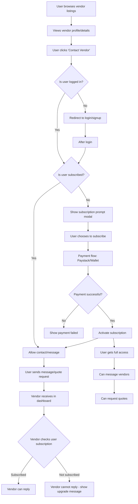

# User Subscription Feature Implementation Plan

## Overview

Implement a premium subscription system that allows users to contact vendors directly, ensuring serious buyers and reducing spam for vendors.

## User Flow Diagram



## Data Model

### User Profile Extension

```json
{
  "subscription": {
    "is_active": true,
    "start_date": "2024-01-15T00:00:00Z",
    "end_date": "2024-02-15T00:00:00Z",
    "plan_type": "premium",
    "auto_renew": true
  }
}
```

## API Endpoints

1. `GET /auth/profile/me/` - Include subscription data in response
2. `POST /subscriptions/user/initiate/` - Initiate subscription payment
3. `POST /subscriptions/user/verify/` - Verify payment and activate subscription
4. `GET /subscriptions/user/status/` - Get detailed subscription status
5. `POST /subscriptions/user/cancel/` - Cancel subscription

## Components to Create

1. `SubscriptionPromptModal` - Modal shown when unsubscribed user tries to contact
2. `UserSubscriptionPage` - Page for subscription management and payment
3. `ContactVendorButton` - Button component with subscription check
4. `SubscriptionStatusIndicator` - Shows subscription status in UI

## Redux State Management

- `userSubscriptionSlice` for managing subscription state
- Update `authSlice` to include subscription status
- Update `profileSlice` to handle subscription data

## Implementation Steps

1. Create Redux slice for user subscription
2. Add subscription APIs to `api.js`
3. Create subscription prompt modal
4. Add contact button to vendor profiles
5. Implement subscription checks in messaging
6. Update vendor dashboard to show user subscription status
7. Add subscription management page
8. Update routing in App.jsx
9. Test complete flow

## Payment Integration

Follow existing Paystack/wallet payment pattern:

- Initiate payment
- Redirect to Paystack or process wallet payment
- Verify payment on callback
- Activate subscription on success

## Vendor Restrictions

- Vendors can only see messages from subscribed users
- Unsubscribed user messages show as "locked" or hidden
- Vendor dashboard shows subscription status of message senders
